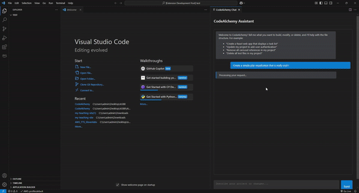

# CodeAlchemy

**CodeAlchemy** transforms natural language into code through a simple, intuitive interface in VS Code. Unlike other complex AI coding tools, CodeAlchemy focuses on simplicity and visual feedback.

## ✨ Extreme Simplicity by Design

In a world of bloated, complicated tools, CodeAlchemy takes a different approach:

- **Single-purpose focus**: Generate, update, or refactor code with natural language
- **Minimal UI**: Just type what you want, no complex configurations
- **Visual feedback**: See your code being written character-by-character
- **Focused functionality**: Does one thing extremely well

## See CodeAlchemy in Action

## 🚀 Key Features

- **Project Creation**: Generate entire project structures from natural language descriptions
- **Code Updates**: Modify existing files through conversational requests 
- **Code Refactoring**: Find and modify patterns across multiple files
- **Visual Editor**: Watch files being created and modified with LLM-like typing animation

## 🔧 Requirements

- VS Code 1.60.0 or higher
- AWS account with Bedrock access
- Environment variables for AWS credentials

## 📥 Installation

1. Clone this repository
2. Run `npm install`
3. Create a `.env` file with your AWS credentials:
    - AWS_ACCESS_KEY_ID=your_access_key
    - AWS_SECRET_ACCESS_KEY=your_secret_key
    - AWS_REGION=your_region
    - AWS_BEDROCK_MODEL_ID=your_bedrock_model_arn
4. Press F5 to run the extension in development mode

## 💻 Usage

1. Open the CodeAlchemy panel from the activity bar (or Click CTRL + SHIFT + C)
2. Type a natural language request describing what you want to create or modify
3. Watch as your code appears before your eyes with character-by-character animation

## ⚙️ Animation Settings

CodeAlchemy offers customizable animation speeds:

- **Slow**: Character-by-character typing like an LLM
- **Normal**: Balanced speed for visibility and efficiency
- **Fast**: Quicker animations for productivity

Adjust in settings or toggle using the command palette.

## 🌟 Why Choose CodeAlchemy?

Many AI coding tools overwhelm you with features and complexity. CodeAlchemy is:

- **Focused**: Does one thing extremely well
- **Intuitive**: No learning curve required
- **Transparent**: See exactly what's changing in your files
- **Lightweight**: Minimal impact on your development environment

## 🗺️ Roadmap

CodeAlchemy is just beginning its journey. Here's what's on the horizon:

### 📅 Q2 2025: "The Artisan" Update
- **Local LLM Support**: Run CodeAlchemy with local models, no cloud required
- **Enhanced Animation**: More fluid typing animations with syntax-aware pauses
- **Context Understanding**: Smarter code generation based on project structure

### 📅 Q3 2025: "The Craftsman" Update
- **Interactive Refactoring**: Guided, step-by-step code transformations
- **Animation Themes**: Customize animation styles and behaviors
- **Vibe Coding**: Speak to code :)

### 📅 Q4 2025: "The Alchemist" Update
- **Intelligent Test Generation**: Create tests for newly generated code
- **Smart Animations**: Highlight logic flows and connections as code is written

### 🌟 Long-term Vision
- **No-dependency Mode**: Run without external AI services
- **Code Evolution Playback**: Visualize how your codebase has evolved over time
- **Supporting Multiple IDEs**: Making this extension available for multiple IDEs rather than just VS Code

Each update will maintain CodeAlchemy's core values of simplicity, focus, and visual feedback.

---

💡 **Have ideas?** We'd love to hear how you're using CodeAlchemy and what would make it even better for your workflow. Open an issue or discussion to share your thoughts!
